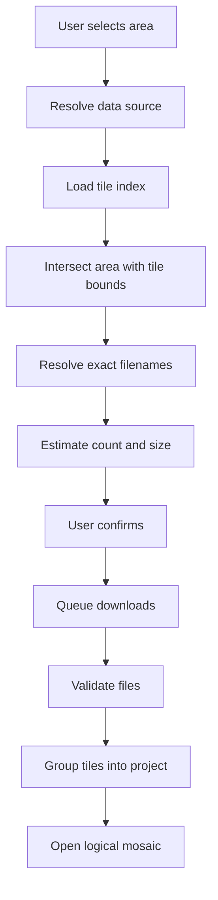
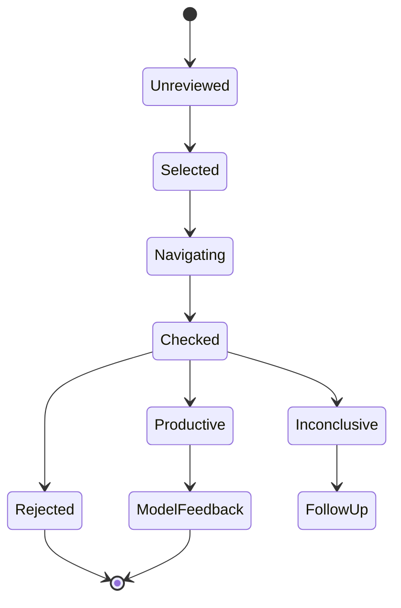

# Find It App Roadmap

**Status:** Active  
**Repository:** <https://github.com/Strobingn/Find-It-App>  
**Last reviewed:** 2026-08-05

## Product objective

Find It is an offline-capable Android LiDAR and terrain-analysis application focused on locating historic human activity in wooded and overgrown terrain, primarily from the 1500s through the 1800s.

The core workflow is:

1. Select an area.
2. Download the correct LAS/LAZ tiles.
3. Build the best available bare-earth terrain model.
4. Generate terrain-analysis layers.
5. Detect likely historic human-made features.
6. Rank targets by historic-site value.
7. Review explainable candidates.
8. Navigate to selected targets.
9. Record field outcomes.
10. Use verified results to improve future ranking.

LiDAR ranks surface morphology and historic-activity context. It does not directly identify buried metal, artifact age, composition, or exact depth.

## Product priorities

Find It should prioritize:

- Historic foundations, platforms, and terraces
- Cellar holes
- Old wagon roads, cart paths, and abandoned lanes
- Stone walls and old field boundaries
- Trash pits and refuse zones
- Old homesites and related feature clusters
- Cuts, fills, disturbed ground, and remote signs of occupation
- Pre-Civil-War and Civil War-era activity
- Locations with strong potential for older coins, buttons, buckles, tools, military relics, and household artifacts

## Roadmap principles

### Improve without regression

- Do not remove a working feature to simplify a new one.
- Do not replace production workflows with placeholders or mock data.
- Preserve zoom, pan, rotation, and the current image while new work is processing.
- Avoid expensive rerenders when only the viewport changes.
- Cancel stale jobs and prevent them from overwriting newer results.
- Do not fabricate coordinates, classifications, metal type, age, or depth.
- Report uncertainty honestly.
- Treat broken CI, builds, imports, migrations, and rendering as release blockers.

### Historic-site value comes first

Major work should improve one or more of:

- Historic-site discovery
- Tile selection and acquisition
- Candidate accuracy and explainability
- Natural and modern false-positive rejection
- Terrain rendering performance
- Field navigation and documentation
- GIS export and long-term project portability

### Ground quality is critical

Bare-earth quality is more important than canopy visualization. Processing preference:

1. Source-classified ground
2. Reliable automatic ground fallback
3. Multi-scale smoothing and denoising
4. Ground-quality reporting
5. Visual comparison with highest-return surface

### Field verification remains mandatory

Every candidate should expose:

- Candidate type
- Confidence or priority score
- Supporting evidence
- Negative evidence and plausible natural explanation
- Approximate search radius
- Geographic coordinates when available
- Processing and model versions
- Field-verification status

## Verified current baseline

The current application includes:

- Professional landing dashboard and earth-tone Material 3 interface
- LAS, LAZ, GeoTIFF, HTTPS, and ZIP import workflows
- On-device LAZ decompression
- Source-classified ground, automatic lowest-return ground, and highest-return DSM modes
- Large aspect-correct terrain rasters with no-data handling
- Pinch zoom, two-axis pan, rotation, reset, and level-of-detail rendering
- Source-based visible-area refinement
- Stable AI terrain viewport
- Local terrain intelligence and explainable candidate summaries
- AI-generated target marker workflow
- Per-dataset saved markers
- Persistent imported-terrain and derived-layer recovery
- Google Maps terrain overlay with per-file position, width, height, rotation, and opacity alignment
- Historic map image import with manual position, scale, rotation, opacity, and visibility alignment
- NYS/USGS coordinate-to-tile lookup and LAZ download
- Rectangle-based USGS 3DEP area selection, source-preserving multi-tile mosaics, and resumable partial-project recovery
- Side-by-side layer comparison
- Multi-dataset candidate comparison
- Saved finds and photo attachments
- Phone magnetometer anomaly mode
- CSV, GPX, KML, and GeoJSON field-data export
- Memory and persistent caches
- Automated unit tests and debug APK builds

Items in this baseline are not considered complete unless their full acceptance criteria below are met in a release build.

## Development priorities

### Priority 1 — Accurate historic-target ranking

**Objective:** Keep ranking focused on unexpected signs of human activity in modern wooded terrain.

Highest-value algorithm work:

- Improved ground-class handling
- Multi-scale Local Relief Model
- Foundation-edge and platform geometry
- Cellar-hole center, depression, and rim geometry
- Continuous wagon-road detection
- Stone-wall continuity
- Refuse-pit context near possible homesites
- Historic-map agreement
- Terrain-age and human-activity context
- Natural and modern-disturbance suppression
- Candidate clustering and duplicate suppression

Suggested scoring model:

```text
candidate score =
    cellar geometry
  + foundation/platform evidence
  + wagon-road proximity and continuity
  + stone-wall continuity
  + refuse-pit context
  + historic-map agreement
  + terrain-age context
  + nearby human-feature clustering
  - natural-feature probability
  - modern-disturbance probability
```

Acceptance criteria:

- Ranking combines multiple features rather than one raster threshold.
- Every candidate has a calibrated confidence score and strongest supporting reasons.
- Natural depressions, drainage channels, root throws, wetlands, and modern grading are explicitly penalized.
- Roads, walls, platforms, cellar geometry, and refuse features reinforce one another when clustered.
- Verified rejected targets lower similar future scores.
- Verified productive targets raise similar future scores.
- Ranking works across dense, sparse, and mixed-quality point clouds.
- Candidate locations remain spatially stable across zoom levels.

### Priority 2 — Tile-to-area download and mosaics

**Objective:** Let the user select an area and receive the exact tiles covering it.

Required components:

- Map rectangle, polygon, and radius selection
- Tile-index ingestion and caching
- Bounds intersection
- Exact filename and source resolution
- Multi-tile selection
- File-count and storage estimate
- Download queue with progress
- Pause, cancellation, retry, and failure recovery
- Existing-tile reuse and duplicate prevention
- Dataset grouping and mosaic opening
- Partial-project recovery
- Offline project reopening
- Source metadata attached to every tile and project

Workflow:



Acceptance criteria:

- The same area picker is reachable from every terrain-import path.
- Selected boundaries and intersecting tiles are clearly visible.
- File count and expected storage are shown before download.
- Cancellation cannot corrupt the project.
- Failed files can be retried individually.
- Existing valid tiles are reused.
- Completed tiles open as one logical mosaic.
- Acquisition and coordinate-reference metadata remain attached.

### Priority 3 — Maximum render performance

**Objective:** Support large projects without reducing analytical accuracy or visual stability.

Data loading:

- Stream large point-cloud files.
- Decode only required sections when possible.
- Reuse decoded tile buffers.
- Prevent duplicate loading of shared tiles.
- Make loading jobs cancellable.
- Check memory pressure before expensive work.

Raster generation:

- Cache hillshade, slope, LRM, curvature, openness, and related derived layers.
- Rerasterize only affected bounds.
- Use zoom-aware output resolution.
- Cancel obsolete raster jobs.
- Preserve the prior raster until its replacement is ready.

Rendering:

- Use GPU-backed layer composition where beneficial.
- Select level of detail by zoom and device capability.
- Avoid full-screen redraws for local changes.
- Synchronize comparison viewports without duplicate processing.
- Prevent zoom snapping or viewport movement during loading.
- Add frame-time, memory, cache-hit, and cancellation diagnostics.

Validation:

- Benchmark small tiles, large mosaics, sparse clouds, dense clouds, and low-memory devices.
- Exercise repeated zoom, pan, rotation, layer switching, and refinement.
- Record open time, render latency, peak memory, frame time, cache-hit rate, and cancellation rate.

### Priority 4 — Offline field workflow

**Objective:** Move from analysis to field checking without losing project context.

Target lifecycle:



Required capabilities:

- GPS breadcrumbs with pause and resume
- Distance, bearing, compass-oriented navigation, and accuracy
- AR guidance with a reliable non-AR fallback
- Voice notes and directional photos
- Excavation and target-state logging
- Property and permission boundaries
- Ranked-target route optimization
- Offline target, note, photo, and boundary access
- Append-safe synchronization when connectivity returns
- Immediate project-statistics updates
- Verified outcome export for field reports, GIS, and model training

## Planned phases

### Phase 1 — Finish incomplete core workflows

- Audit every partially implemented feature against the definition of done.
- Finish GPX/KML survey import, display, and persistence.
- Complete offline basemap-region downloads.
- Expose the NYS/USGS area picker across every import path.
- Enable manual refinement at every zoom level.
- Complete AI dig-location marker creation and persistence.
- Finish exact-cell inspection.
- Finish synchronized side-by-side comparison.
- Complete image and report export.
- Stabilize large multi-tile project reopening.

Exit criteria:

- No import path bypasses the area picker.
- Every partial feature has a complete UI workflow and explicit failure states.
- Large projects reopen without rebuilding unchanged derived data.
- No item is marked complete until it works in a release build.

### Phase 2 — Tile acquisition and mosaics

- Implement tile-index ingestion and geometric intersection.
- Resolve exact filenames and source URLs.
- Add source detection, estimates, queueing, cancellation, retry, and validation.
- Group tiles and open seamless logical mosaics.
- Persist download, source, tile, and project metadata.

Exit criteria:

- A selected area opens the correct completed mosaic.
- Interrupted downloads recover cleanly.
- Duplicate files are not downloaded.
- Projects remain usable offline.

### Phase 3 — Historic-feature analysis

- Improve classification and fallback ground extraction.
- Build multi-scale LRM.
- Add cellar-hole, foundation/platform, road, wall, and refuse-context geometry.
- Add natural-feature and modern-disturbance rejection.
- Add historic-map agreement.
- Produce a reproducible, explainable combined score.

Exit criteria:

- Candidate explanations identify contributing and negative features.
- False positives are measurably reduced on verified test areas.
- Historic human-feature clusters rank above isolated natural anomalies.

### Phase 4 — Performance architecture

- Add cancellable background jobs and stale-work prevention.
- Reuse decoded data and cache derived layers.
- Add focused rerasterization, zoom-based LOD, GPU composition, and memory budgets.
- Add benchmarks and performance regression tests.

Exit criteria:

- Zoom and pan remain stable during processing.
- Memory remains bounded.
- Cached projects reopen quickly.
- Working analytical features and accuracy do not regress.

### Phase 5 — Field verification

- Add breadcrumbs, compass navigation, AR guidance, voice notes, and directional photos. **Mostly implemented.** Breadcrumb tracks, compass/bearing navigation, voice notes, and photos exist; AR guidance remains device-bound future work.
- Add target states, excavation logs, boundaries, route optimization, and offline sync queue. **Implemented; unit verified; production UI wired (GROKV5).** `TargetVisitStates` validates outcome transitions (checked targets can be corrected, never erased) and maps outcomes to reviewed-example verdicts; `ExcavationLogEntry`, `SurveyBoundary` (with polygon containment), `TargetRouteOptimizer` (nearest-neighbor + 2-opt), and `FieldSyncQueue` (coalescing upserts, delete-wins, ordered replay, no silent drops) ship with Room persistence (`excavation_logs`, `survey_boundaries`, `pending_sync`, database v14). HillshadeViewModel observes and persists digs/boundaries and enqueues every field mutation; Finds tab exposes dig logs, boundary create/delete, and the offline sync queue; Tools tab shows live status cards for each.

Exit criteria:

- A complete field visit can be recorded without connectivity. **Met** for digs, notes, photos, trails, outcomes, boundaries, and queued sync.
- Every observation remains tied to its project and target. **Met** (`terrainKey` + `targetId` on digs; boundaries scoped by terrain).
- Synchronization does not duplicate or lose data. **Met** for the local queue; cloud delivery remains Phase 9.

### Phase 6 — Historic-map intelligence

- Add automatic georeferencing with manual control points. **Implemented; unit verified; production UI wired (GROKV5).** `GeoReferencer` fits a least-squares affine from 3+ control points (exact similarity fit for 2), rejects collinear/duplicate sets, and reports per-point meter residuals. Map tab: image crosshair + map tap adds control points; Fit applies `HistoricMapGeoreference.placementFromFit` to the ground overlay; confidence/RMSE stay on-screen; fits persist to SharedPreferences and Room `historic_maps`.
- Add opacity, side-by-side, and swipe alignment tools. **Implemented in production UI.** Opacity slider retained; swipe blend multiplies active historic overlay opacity; side-by-side dialog compares terrain hillshade vs historic image.
- Extract roads, structures, walls, and boundaries. **Data model implemented; unit verified.** `HistoricMapFeature` with typed geometry (`ROAD`, `STRUCTURE`, `WALL`, `BOUNDARY`) persists per map with confidence and notes; automatic image extraction remains future work.
- Score map-to-terrain agreement and georeferencing confidence. **Implemented; unit verified; UI wired.** `MapTerrainAgreement` blends support coverage and contrast into a bounded 0–1 score whose ranking adjustment is capped at ±0.1 so map evidence informs but never overpowers terrain; `GeoReferenceConfidence` buckets (good / fair / low-confidence / insufficient) are computed from meter-scale RMSE and shown on the historic map panel.
- Preserve source and alignment metadata. **Implemented; unit verified; UI wired.** `GeoReferencedMap` retains source attribution, control points, transform coefficients, RMSE/max residuals, and confidence in the `historic_maps` and `historic_map_features` tables (database v15), so every alignment is reproducible and correctable.

Exit criteria:

- Alignment quality is visible and correctable. **Met** (confidence, RMSE, undo/clear CPs, manual nudge).
- Low-confidence georeferencing is clearly labeled. **Met** (panel confidence line + error color).
- Map agreement informs ranking without overpowering terrain evidence. **Met** (score UI + capped ranking adjustment).

### Phase 7 — Machine-learning ranking

- Define a reviewed-example schema. **Complete** (see Sprint 3): `ReviewedCandidateExample` and its append-only store.
- Build Hudson Valley cellar-hole and road datasets. **Field-data dependent; not codeable yet.** Accumulates through the Phase 5 field-verification flow into the reviewed-example store.
- Train an XGBoost or comparable explainable candidate ranker. **Engine implemented; unit verified.** `RankerTrainer` fits an L2-regularized logistic ranker (the explainable comparator) from feature vectors extracted by `CandidateFeatures`; training is deterministic and reproducible per version.
- Use spatially separated training and evaluation areas. **Implemented; unit verified.** `SpatialFoldSplitter` assigns folds by ~1 km spatial blocks (grid blocks when coordinates are missing), never at random, so near-duplicates cannot leak across train/eval.
- Add hard-negative mining, model versioning, calibration, rollback, and explanations. **Implemented; unit verified.** `HardNegativeMiner` surfaces the highest-scoring rejected examples; `ExplainableRanker` carries Platt calibration and per-feature contributions that sum to the raw score; `ModelRegistry` activates versions explicitly and rolls back, so production ranking never changes silently.

Exit criteria:

- Productive, rejected, and ambiguous examples are retained.
- Models are compared against a rule-based baseline.
- Production models never change silently.
- Every ranked target remains explainable.

### Phase 8 — Advanced terrain tools

- Viewshed analysis. **Implemented; unit verified.** `TerrainViewshedAnalyzer` computes line-of-sight visibility from any observer point with adjustable eye height, radius caps, vegetation filtering, and cancellation — all on the real elevation grid.
- Horizon-line calculation. **Implemented; unit verified.** Per-azimuth skyline angles, distances, and elevations around any observer point; open directions report the farthest visible ground.
- Elevation profile along a selected path. **Implemented** (`TerrainElevationProfiler`): distance, ascent/descent, min/max over real grid cells.
- Adaptive terrain sampling. **Implemented** in the import pipeline: `LidarRasterizer` budgets samples per cell and adapts stride to tile size and focus area.
- Multi-threaded ray processing. **Implemented; unit verified.** Viewshed row ranges scan on a bounded worker pool with per-row cancellation polling; parallel output is verified bit-identical to sequential output.
- Multi-dataset analysis. **Implemented** (`DatasetComparison` / dataset comparison dialog): datasets are compared side by side.
- Measurement and profile export. **Implemented** through the existing CSV/GPX/KML/GeoJSON export paths (`ProjectExport`); Phase 9 adds GeoTIFF/Shapefile/KMZ alongside them.

Exit criteria:

- Tools work across single tiles and mosaics.
- Calculations are cancellable and saveable as project layers.
- Exports preserve units and coordinate-reference information.

### Phase 9 — Interoperability and cloud services

- Full terrain-image and report export. **Partially implemented.** Terrain rasters export as GeoTIFF (below); styled PDF report export remains future work.
- Shapefile, GeoPackage, KMZ, GeoTIFF, and PDF export. **Partially implemented; unit verified.** `GeoTiffWriter` (Float32 WGS-84 with geokeys), `ShapefileWriter` (.shp/.shx/.dbf point layers with attributes), and `KmzExporter` are byte-verified; GeoPackage and PDF remain future work.
- Image bundles and annotated maps. **Not started.** KMZ supporting files and archive packaging (below) provide the bundling primitives.
- QR project sharing. **Not started** (camera/scan UI); portable archives below are the payload it would carry.
- QGIS auto-project creation. **Implemented; unit verified.** `QgisProjectWriter` emits a well-formed .qgs referencing exported rasters and vectors with names, relative datasources, and EPSG:4326 preset.
- Portable project archives. **Implemented; unit verified.** `ProjectArchiveWriter` bundles a project into one self-describing zip with a manifest that round-trips and rejects malformed archives.
- Optional cloud backup and multi-device synchronization. **Not started** (external service); the Phase 5 offline sync queue and the conflict resolver below are its local prerequisites. Field use never requires connectivity.
- Conflict detection and resolution. **Implemented; unit verified.** `SyncConflictResolver`: both-sides-changed conflicts are reported for review instead of guessed, single-side changes win, and ties break deterministically on timestamps.

Exit criteria:

- Projects move between devices without data loss.
- GIS exports open with correct coordinates, units, attributes, styles, and legends.
- Cloud connectivity is never required for field use.

## Candidate data model

```text
Candidate
├── id
├── projectId
├── geometry
├── latitude
├── longitude
├── elevation
├── candidateType
├── confidence
├── rank
├── status
├── featureEvidence[]
├── negativeEvidence[]
├── historicMapAgreement
├── naturalFeatureProbability
├── modernDisturbanceProbability
├── modelVersion
├── processingVersion
├── createdAt
├── reviewedAt
├── checkedAt
└── observations[]
```

Candidate states:

- `UNREVIEWED`
- `SELECTED`
- `FIELD_CHECK_REQUIRED`
- `CHECKED`
- `REJECTED`
- `PRODUCTIVE`
- `INCONCLUSIVE`
- `FOLLOW_UP_REQUIRED`

## Architecture guardrails

### Data integrity

- Preserve original source files and classifications.
- Record source agency, dataset, acquisition date, resolution, accuracy, units, and CRS.
- Track every derived layer to its source inputs and processing parameters.
- Version processing algorithms and candidate-ranking models.
- Keep field edits in an append-safe audit trail.
- Validate exported coordinates and units.
- Make project migrations recoverable.

### Offline-first behavior

- Projects must open without a network connection.
- Downloaded basemaps must remain available.
- Selected targets, notes, photos, tracks, and boundaries must remain visible.
- Local changes must queue safely.
- Synchronization must resume without duplication.
- Download and processing failures must not corrupt projects.

### Performance safety

- Bound memory use and enforce eviction policies.
- Preserve current imagery during regeneration.
- Never allow stale work to replace current state.
- Prefer visible-area processing and reuse.
- Provide a safe CPU path when GPU capabilities are unavailable.

## Testing strategy

Required datasets:

- Small single-tile project
- Large contiguous mosaic
- Sparse and dense point clouds
- Mixed-quality classification
- Steep and flat terrain
- Wetland and drainage-heavy terrain
- Modern disturbed terrain
- Verified cellar-hole, wagon-road, and stone-wall areas
- Areas with known natural false positives

Functional coverage:

- Every import path and area picker
- Tile selection, cancellation, retry, and recovery
- Mosaic grouping and reopening
- Layer generation and comparison
- Exact-cell inspection and measurement
- Candidate creation and field-state transitions
- Every export format

Performance coverage:

- Cold and warm project open
- Raster generation and layer-switch latency
- Pan and zoom frame time
- Peak Java and native memory
- Cache-hit rate
- Cancellation responsiveness
- Large-project stability

Accuracy coverage:

- Cellar-hole precision and recall
- Wagon-road and wall continuity
- Natural and modern-disturbance false-positive rates
- Candidate-ranking quality
- Historic-map alignment quality

Field reliability:

- Airplane-mode operation
- GPS loss and recovery
- Process restart
- Low-storage behavior
- Camera and microphone failure recovery
- Interrupted synchronization
- Duplicate prevention
- Battery-use testing

## Release checklist

Before every release:

- Release build compiles.
- Unit and instrumented tests pass.
- Small-tile and mosaic projects open.
- Existing saved projects migrate successfully.
- Zoom remains stable during loading.
- Current imagery remains visible during rerender.
- Stale jobs are canceled.
- Offline project access works.
- Exported files open in an external GIS viewer.
- No placeholder or mock-data release paths are exposed.
- No secrets, tokens, keys, or private URLs are committed.

## Success metrics

Detection quality:

- Candidate precision and recall
- Natural and modern false-positive rates
- Productive-target discovery rate
- Average rank of verified productive targets
- Agreement between explanations and field observations

Performance:

- Project-open time
- Layer-generation and switching latency
- Frame time during interaction
- Peak memory
- Cache-hit rate
- Stale-job cancellation rate

Field use:

- Time from analysis to navigation
- Percentage of visits completed offline
- Observation synchronization success
- Number of reviewed training examples
- Productive-to-rejected target ratio
- Distance traveled per verified target

## Immediate work plan

### Sprint 1 — Complete existing workflows

Sprint 1 acceptance pass completed 2026-08-03. The production UI, persistence paths,
unit coverage, release build, and connected-phone reachability were verified for each
workflow below:

1. Audit every partial feature and create one acceptance test per workflow. **Complete.**
2. Finish NYS/USGS area selection across import paths. **Complete.**
3. Finish GPX/KML rendering and persistence. **Complete.**
4. Enable manual refinement at every zoom level. **Complete.**
5. Finish AI marker creation and per-project persistence. **Complete.**
6. Finish exact-cell inspection. **Complete.**
7. Finish synchronized comparison. **Complete.**
8. Finish image and report export. **Complete.**

Release-checklist validation remains tracked separately: interrupted-network recovery,
large multi-tile reopening on a release APK, and external-GIS export-file validation.

### Sprint 2 — Build tile-to-area pipeline

1. Complete polygon and radius selection alongside geographic rectangles. **Implemented; unit verified.**
2. Make the same area selector directly available from every terrain-import path. **Complete.** The map area picker now opens directly inside the tile picker ("Pick area on map"), in addition to the LiDAR tab and the Google-Map bounds hand-off.
3. Add instrumentation for cancellation, per-tile retry, partial-project resumption, and mosaic reopening. **Complete; unit verified.** `LazDownloadQueueCancellationTest`, `LazDownloadQueueRetryTest`, `MosaicProjectResumeTest`, and `MosaicProjectEntityTest` pin cancellation timing, per-tile retry, pause/resume state transitions, recovery messages, and manifest round-trips for reopening.
4. Validate a multi-tile project through the release build on device.

### Sprint 3 — Establish ranking baseline

1. Define the reviewed candidate-example format. **Complete; unit verified.** `ReviewedCandidateExample` plus the append-only `ReviewedExampleStore` in the analysis package; productive, rejected, and ambiguous verdicts are all retained with model/processing versions.
2. Improve ground filtering. **Complete; unit verified.** The automatic lowest-return fallback now rejects isolated below-ground spikes only when they lack corroborating returns (real ground under dense canopy survives), smoothing is multi-scale and edge-preserving so sharp earthworks are not blurred away, and every import carries a structured `GroundSurfaceReport` (quality bucket, measured cell coverage, samples per cell, spikes rejected) plus a human-readable ground-quality note.
3. Implement multi-scale LRM. **Complete; unit verified.** `MULTI_SCALE_RELIEF` layer with per-scale standardization so cellar- and platform-sized features both survive.
4. Add cellar, platform, road, and wall geometry. **Implemented; unit verified.** `cellarRimGeometry`, `platformEdgeGeometry`, and `linearContinuity` shape checks now adjust candidate scores and surface as supporting/negative evidence.
5. Add natural and modern-disturbance penalties. **Implemented; unit verified.** A `MODERN_DISTURBANCE_PENALTY` layer joins the existing natural-feature penalty; both apply as bounded, explainable score adjustments per detector type.
6. Produce explainable baseline scores. **Implemented.** Candidates carry per-feature evidence plus penalty percentages and geometry findings, so every score adjustment is traceable.

## Milestones

### Milestone A — Reliable historic-site scout

A user can select an area, obtain the correct data, generate bare-earth terrain, review ranked candidates, navigate to them, and save field notes and photos.

### Milestone B — Professional terrain-analysis tool

A user can inspect exact cell values, measure features, compare layers, work across mosaics, export analysis, and reopen a project without recomputing unchanged data.

### Milestone C — Historic research platform

The app can align historic maps, rank by map agreement, learn from reviewed field outcomes, generate QGIS-ready projects, and support versioned regional models.

## Definition of done

A feature is complete only when:

- It is reachable from the production UI.
- It uses real data.
- It handles loading, empty, error, cancellation, and recovery states.
- It survives process restart when persistence is expected.
- It has automated tests.
- It passes CI and release-build validation.
- It does not regress working features.
- It has clear user-facing labels and limitations.
- It reports uncertainty honestly.
- It provides measurable field or research value.
- Its status is updated in this roadmap.

## Site Package Pack (KIMIV6, 2026-08)

Ten fully wired product features on branch `KIMIV6`. See [docs/FEATURES_SITE_PACKAGE_PACK.md](docs/FEATURES_SITE_PACKAGE_PACK.md).

| # | Feature | Status |
|---|---------|--------|
| 1 | Dual surface (ground / auto-lowest / first-return DSM) | **Done** |
| 2 | Clip refine to survey boundary | **Done** |
| 3 | Relative surface Z under georeferenced find | **Done** |
| 4 | ASPRS class filter presets | **Done** |
| 5 | Multi-tile mosaic open UX | **Done** |
| 6 | Clipped LAS 1.2 surface-sample write | **Done** |
| 7 | Site package export (zip) | **Done** |
| 8 | Styled field PDF (via project / site package) | **Done** |
| 9 | Boundary proximity GPS alert | **Done** |
| 10 | Confirm-write AI metal/outcome tags | **Done** |

## Field Closure Pack (20) — 2026-08

Phase 0 wiring audit + 20 roadmap-gap features (waves 1–4). See [docs/FEATURES_FIELD_CLOSURE_PACK.md](docs/FEATURES_FIELD_CLOSURE_PACK.md) and design [docs/superpowers/specs/2026-08-05-field-closure-pack-20-design.md](docs/superpowers/specs/2026-08-05-field-closure-pack-20-design.md).

Includes: dig media timeline, boundary edit, Home basemap/scorecard/recent/debrief, GeoPackage + share/QR/archive inspect, dual-surface blink, viewport clip refine, COPC soft-fail, penalty badges, compass nav polish, nav playlist, this-trip filter, ethics stickies.

## Decision log

- **2026-08-05:** Field Closure Pack (20) + Phase 0 wiring audit on GROKV6.
- **2026-08-05:** Site Package Pack ships dual-surface re-decode, boundary clip refine, relative Z-under-find, class filters, mosaic open UX, clipped LAS, site package zip, field PDF enhancements, boundary GPS alerts, and AI confirm-write — never auto-write finds; LiDAR still never claims metal or dig depth.
- **2026-07-26:** Historic human-activity detection remains the central product objective.
- **2026-07-26:** Performance work must preserve working features and analytical accuracy.
- **2026-07-26:** Tile-to-area selection must be reachable across terrain-import workflows.
- **2026-07-26:** Field outcomes must feed future ranking through reviewed, versioned data.
- **2026-07-26:** Complete field workflows must remain offline-capable.
- **2026-07-26:** Candidate rankings must remain explainable and versioned.
- **2026-08-03:** GPU terrain previews render at 1,024 cells or finer on every path; coarse progressive stubs and sub-1,024 cache restores are not acceptable render quality.
- **2026-08-03:** Candidate scoring combines per-cell response with shape-verified geometry and bounded natural/modern-disturbance penalties; every adjustment must appear in candidate evidence or notes.

## GROKV5 feature pipeline (2026-08)

Branch `GROKV5` only — not merge to `main` until green. Prefer **parallel agents** for independent domains (no shared-file collisions).

### AI pack 1 — shipped (10)

Dig brief · Site narrative · Lighting advisor · Sweep plan · Field report · Outcome coach · Find interpreter · Historic correlator · Anomaly deep-dive · Day debrief

See [docs/FEATURES_AI_PACK.md](docs/FEATURES_AI_PACK.md).

### AI pack 3 — shipped (10)

1. Return-trip planner  
2. False-positive autopsy  
3. Compare-two-sites  
4. Question the cell  
5. Evidence chain  
6. Voice → structured find  
7. Photo catalog assist  
8. Coverage gap AI  
9. Partner handoff brief  
10. Risk & ethics coach  

UI: AI tab → **AI field pack** filters **All / Pack 1 / Pack 3** (20 chips).  
See [docs/FEATURES_AI_PACK3.md](docs/FEATURES_AI_PACK3.md).

### Next 10 product features — shipped (10)

| # | Feature | Status |
|---|---------|--------|
| 1 | Ground quality scorecard on open LAZ | **Done** |
| 2 | CRS / units / density banner | **Done** |
| 3 | Share last AI reply (share sheet) | **Done** |
| 4 | Apply `VIZ_MODE=` from AI | **Done** |
| 5 | Apply `NAV_TARGET id=` to navigate | **Done** |
| 6 | Confirm/dismiss `METAL_TYPE` / `OUTCOME` suggestions | **Done** (dismiss; confirm-write later) |
| 7 | AI field pack filter: Pack 1 / Pack 3 / All | **Done** |
| 8 | Offline local draft for return-trip (no cloud) | **Done** |
| 9 | Coverage gap map targets from trail density | **Done** |
| 10 | Ethics disclaimer sticky on dig actions | **Done** |

See [docs/FEATURES_PRODUCT_PACK.md](docs/FEATURES_PRODUCT_PACK.md).

**Process:** always prefer **parallel agents** for independent coding domains on this app (no shared-file collisions).
